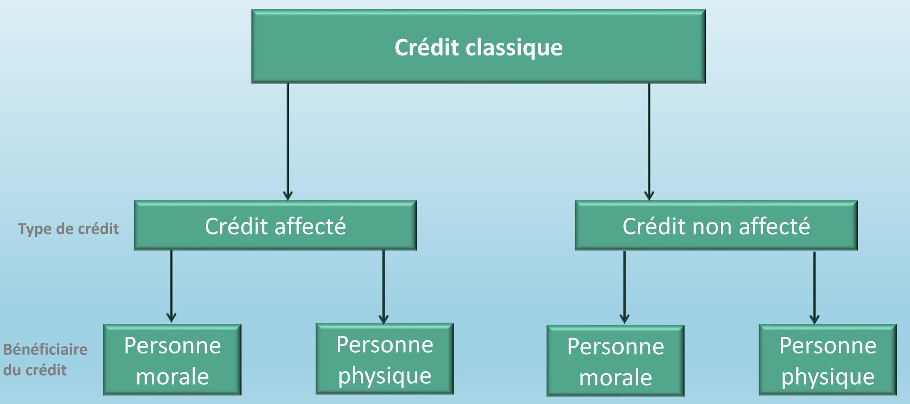
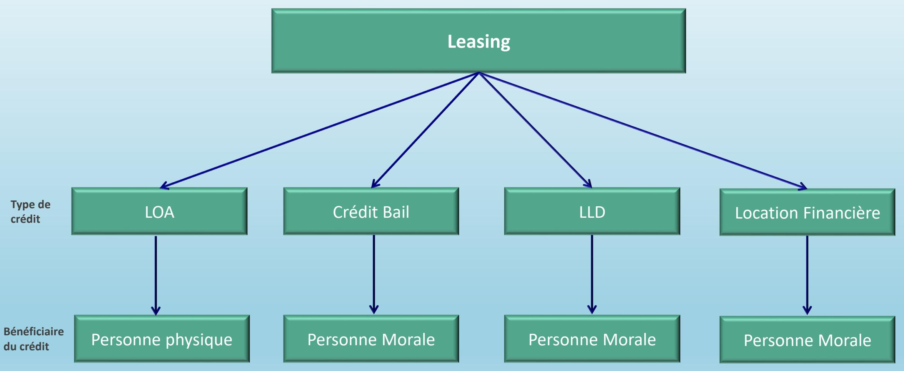
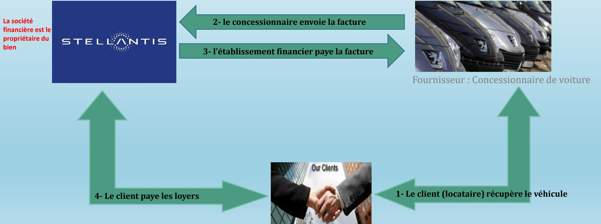
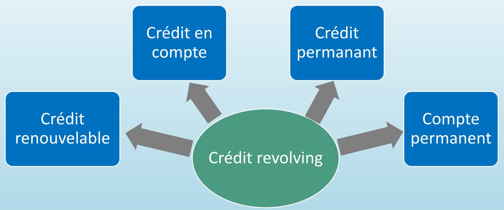
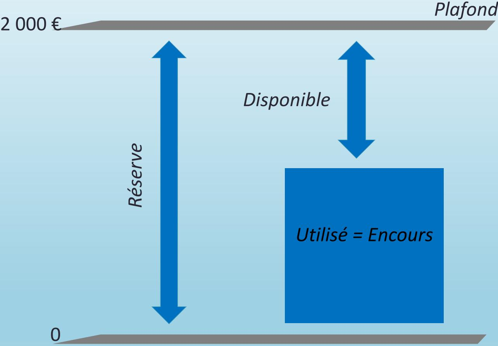
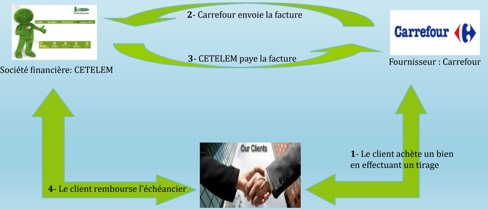
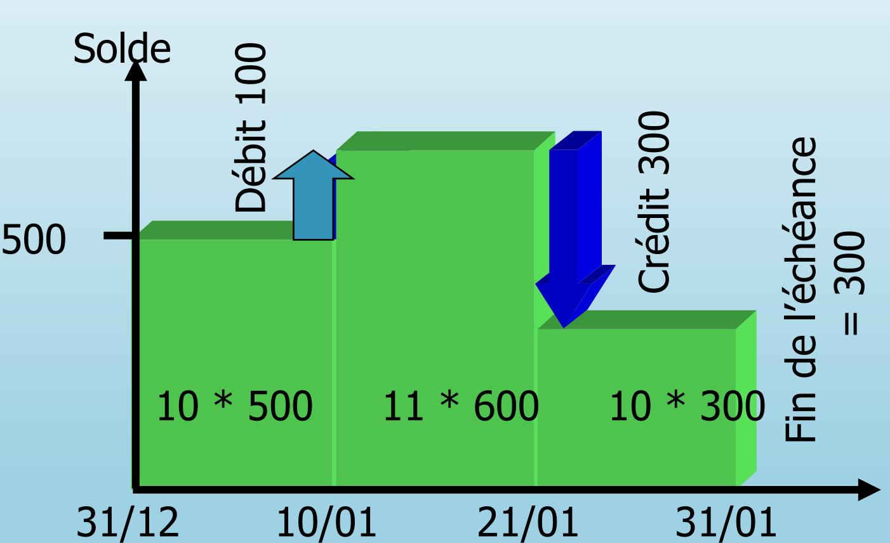

## --- Page 1 --- 
Formation Métiers
du financement
Septembre 2024

## --- Page 2 --- 
Plan formation Métier
Objectifs
❑Avoir une définition claire de ce que s’est un crédit
❑Découvrir les différents paramètres qui interviennent dans la mise en
place d’un crédits,
❑Savoir les différents types d’amortissement d’un crédit
❑Découvrir les différents types de crédits et les différences de montage
et de gestion courante

## --- Page 3 --- 
1 Définitions des Crédits
2 Les Différents types du crédit
3 Les Crédits Classiques
AGENDA
4 Le Leasing
4.1 Principe du Leasing
4.2 Leasing vs Crédits
4.3 Autres Types de Leasing
5 Autres Produits Financiers - Révolving

## --- Page 4 --- 
Qu’est ce qu’un crédit? … Introduction
❑ On dit « Avoir du crédit », « Accorder du crédit à », « Jouir d’un crédit auprès de
quelqu’un », …
❑ Ces expressions en français renvoient toutes à une notion de croyance, de
crédibilité, de confiance.
❑ Une opération de crédit est donc fondée sur la croyance du créancier que le
débiteur sera en mesure de payer sa dette à l’échéance.
❑ Il s’agit fondamentalement d’un acte de confiance du prêteur envers l’emprunteur.

## --- Page 5 --- 
Qu’est ce qu’un crédit? … L’acte de crédit
❑ L’acte de crédit correspond à un engagement de deux parties pour :
❖ Prêter à un tiers une somme d’argent selon des modalités prédéfinies dans l’acte de prêt
➔ C’est l’engagement du prêteur
❖ Rembourser au prêteur les sommes dues selon les conditions acceptées dans l’acte de prêt
➔ C’est l’engagement de l’emprunteur
❑ Cet engagement est concrétisé par la signature d’une offre de prêt/contrat de
prêt:
❖ La distinction des termes utilisés renvoie aux modalités juridiques de conclusion définitive des
engagements des parties
❖ Le financement des particuliers est couvert par des lois ( En France :Scrivener 1, Lagarde, Etc…) : le
prêteur émet le contrat de prêt;
❖ Le financement des personnes morales n’est pas couvert de contraintes restrictives: le prêteur émet un
contrat de prêt

## --- Page 6 --- 
Notions de base… Les paramètres de bases d’un crédit
Financièrement, un crédit moyen terme s’appuie
sur différentes variables qui le component
• Capital emprunté: Montant du crédit consenti par le prêteur. Le capital peut
 être versé en une ou plusieurs fois.
•Taux nominal: Taux de base qui sert au calcul des intérêts sur un prêt ou sur un 
placement. Il  peux être fixe ou variable
• Taux Effectif Global: Taux qui intègre en sus des intérêts l’ensemble des frais 
obligatoires pour l’obtention du prêt, connus ou estimés : - les frais de  dossier - 
les primes d’assurance obligatoire - les frais  de garanties. En France, le TEG du 
prêt ne doit pas dépasser le seuil de l’usure. Pour un  prêt à taux variable, le TEG 
figurant dans le contrat de prêt est donné à  titre indicatif en fonction des 
informations connues au moment de  l’édition de ce contrat de prêt.
•Durée: Elle est déterminée au contrat et peut être fixe ou variable. En général, la  
variation de la durée peut résulter soit de la révision du taux d’intérêt soit du  
report ou de la modulation volontaire de l’échéance par  l’emprunteur.
 •Assurances: Dénommée parfois ADI. Contrat qui garantit le  remboursement 
total ou partiel du crédit en cas de décès  ou de maladie. Très souvent exigée par 
la banque.
 •Garanties: Engagement donné ou reçu, pour assurer le paiement d’une dette ou  
créance. On distingue les garanties personnelles (ex : cautionnement) et les  
garanties réelles (ex : hypothèque)

## --- Page 7 --- 
Notions de base… Principe général d’amortissement
Capital emprunté
Montant du crédit consenti par
le prêteur. Le capital peut être
verséen une ou plusieursfois.
Amortissement
Remboursement prévu en une ou
plusieurs fois d’un emprunt.
Selon le type d’emprunt, il peut être
étalé dans le temps ou effectué en une
Capital restant dû
seule fois en fin de contrat.
Montant du capital restant à
rembourser par l’emprunteur à une
date donnée. Il sert debase au calcul
des intérêts de l’échéance àvenir.

## --- Page 8 --- 
Notions de base… Les techniques d’amortissement
Amortissement par échéances/annuités constantes
L’amortissement avec annuités constantes est la formule la plus souvent rencontrée à l’occasion des remboursements de
crédits. La part des intérêts dans un amortissement avec annuités constantes est plus élevée au départ. Elle va ensuite
diminuer régulièrement tandis que celle du capital remboursé va progressivement augmenter.
Amortissement à capital constant
Le principe de ce mode d'amortissement est que la part de capital remboursée à chaque échéance est la même pendant
toute la durée de l'emprunt.
Ce type d’amortissement est appelé amortissement constant ou linéaire du crédit.
Amortissement « in fine »
L’amortissement in fine implique que pendant toute la durée du crédit, l'emprunteur ne paie que les intérêts.
L'emprunteur rembourse la totalité du capital, en une seule fois à la dernière échéance.
Les intérêts payés sont constants puisqu’ils sont calculés sur le capital total emprunté.

## --- Page 9 --- 
1 Définitions des Crédits
2Les Différents types du crédit
3 Les Crédits Classiques
4 Le Leasing
4.1 Principe du Leasing
4.2 Leasing vs Crédits
4.3 Autres Types de Leasing
5 Autres Produits Financiers - Révolving

## --- Page 10 --- 
Les Différents types du crédit… Notion de bases à connaître
Notion de bases à connaître – Crédits aux Entreprise
------------------------------------------------------------
|  Le  crédit à la consommation est un prêt de professionnel|
|                  à particulier                            |
|-----------------------------------------------------------|       
| - Durée supérieure à 3 mois.                              |
| - Montant inférieur à 75 000 €.                           |
| - Ne sert pas à financer un achat immobilier.             |
-----------------------------------------------------------
--------------------------------------------------------------------------------------------------------------
| LE REVOLVING                                                                                                                                                                                                                   | LE PRET PERSONNEL                                                                                                                                                                                                                           | LE CREDIT AFFECTE                                                                                                                                                             | LA LOCATION AVEC OPTION D'ACHAT                                                                                                                                                                                                                  |
| ------------------------------------------------------------------------------------------------------------------------------------------------------------------------------------------------------------------------------ | ---------------------------------------------------------------------------------------------------------------------------------------------------------------------------------------------------------------------------------------------- | ----------------------------------------------------------------------------------------------------------------------------------------------------------------------------- | --------------------------------------------------------------------------------------------------------------------------------------------------------------------------------------------------------------------------------------------------- |
| • Ligne de crédit permanente dont la réserve se reconstitue au fur et à mesure des remboursements • Le mode d'accès prédominant à la réserve est une carte de crédit ou une carteprivative | • Prêt de trésorerie accordé à titre individuel aux conditions négociées au cas par cas • Le consommateur jouit d'une liberté totale en matière d'utilisation du prêt qui n'est pas prédéterminée par contrat | • Prêt contractuellement lié à l'achat d'un bien de consommation: • Permet de payer en plusieurs fois un équipement électroménager, une voiture | • Appelé aussi leasing • Type particulier de crédit affecté qui sert à l'acquisition de voitures à usage personnel • Offre à l'emprunteur la possibilité d'acquérirla voiture au terme de la période de bail |

             --page 11---

 Les Différents types du crédit…      
Notion de bases à connaître
 Notion de bases à connaître –  Crédits aux Entreprise 

---------------------------------------------------------------
| Ces types de credit sont des prêts de professionnel à       |
|                 professionnel                               |              
---------------------------------------------------------------
| - Durée variable selon le type de crédit.                   |
| - Servent généralement à financer des biens.                |
---------------------------------------------------------------

-------------------------------------------------------------------------------------------------------------------------------------
| LE CREDIT BAIL                                                                                                                                                                                                                                                                                                                                                        | LA LOCATION LONGUE DUREE                                                                                                                                                                                                                                                                                                                        | LE CREDIT NON AFFECTE                                                                                                                                                                             | LA FINANCEMENT DE STOCK                                                                                                                                                                                                                                                                                                                                            |
| --------------------------------------------------------------------------------------------------------------------------------------------------------------------------------------------------------------------------------------------------------------------------------------------------------------------------------------------------------------------- | -------------------------------------------------------------------------------------------------------------------------------------------------------------------------------------------------------------------------------------------------------------------------------------------------------------------------------------------------- | ------------------------------------------------------------------------------------------------------------------------------------------------------------------------------------------------- | --------------------------------------------------------------------------------------------------------------------------------------------------------------------------------------------------------------------------------------------------------------------------------------------------------------------------------------------------------------------- |
| • Destinée au entreprise qui souhaite changer leur parc auto ou bien; • Moyennant un Montant mensuel sur une période qui peut aller de 36 mois à 84 mois max • Pour les CBI, le financement des travaux se fait par tranche et les montant ne seront débloqués que si le bénéficiaire présente les factures correspondantes | • Destinée au entreprise qui souhaite changer leur parc auto ou bien; • Moyennant un loyer mensuel sur une période qui peut aller de 36 mois à 84 mois max • Le bien doit être restitué a la fin de la location au fournisseur du bien; • La société de financement peut reprendre elle aussi le bien | • Prêt de trésorerie accordé pour financer une extension ou bien pour la trésorerie (fond de roulement) de l'entreprise demandeur aux conditions négociées au cas par cas | • Appelé aussi Wholesales ou crédit réseau; • Type de crédit tripartie entre un concessionnaire, un constructeur et une société de financement • Une société de financement finance le parc auto d'un concessionnaire • Le type de montage ressemble à celui du révolving, des agios sont calculés journalièrement |

## --- Page 12 --- 
1 Définitions des Crédits
2 Les Différents types du crédit
3Les Crédits Classiques
4 Le Leasing
4.1 Principe du Leasing
4.2 Leasing vs Crédits
4.3 Autres Types de Leasing
5 Autres Produits Financiers - Révolving

## --- Page 13 --- 
Les Différents Types de Crédits… Crédits Classiques
1 Principes et Règles de Gestion
2 Les Types d’amortissement d’un crédit bancaire
3 Moulinette de calcul

## --- Page 14 --- 
Crédit Classique Principes et règles de gestion 1/4

## --- Page 15 --- 
Crédit Classique Principes et règles de gestion 2/4
1. Type de crédit
a. Le prêt affecté ou crédit affecté:
❑ Ce type de crédit est lié à un achat spécifique. L’argent prêté ne peut être utilisé que pour l’achat
mentionné. La destination de cet argent ne peut être modifiée et ce prêt ne peut donc pas servir à autre
chose. Bien souvent, le bien concerné est pris en garantie, et la durée du prêt est bien souvent inférieure à
la durée de vie prévisible du bien.
❑ Vous ne remboursez votre crédit qu’à réception de votre bien. Si votre achat n’a pas lieu, ou n’est pas livré,
le crédit est annulé.
❑ Ce type de crédit est très souvent proposé sur le lieu de vente. Son taux est souvent plus élevé qu’un prêt
personnel classique.
➔ Les fonds sont versés au vendeur du bien
b. Le prêt non affecté ou crédit non affecté
❑ Il s’agit d’un contrat de crédit de courte, moyenne ou longue durée : Ce type de crédit peut se souscrire
pour quelques mois comme quelques années.
❑ Les sommes d’argent prêtées sont remboursées par versements périodiques : ce sont les mensualités.
❑ Il permet de faire face aux dépenses de la vie courante.
❑ Les fonds sont versés sur le compte de l’emprunteur après acceptation de son dossier. Il en dispose quand il
le souhaite.
❑ Les remboursements anticipés sont possibles et sont réalisés sans frais, et son coût est en général plus
faible que ceux des prêts affectés sur le lieu de vente.

## --- Page 16 --- 
Crédit Classique Principes et règles de gestion 3/4
2. Fonctionnement:
Supposons qu'une entreprise souhaite effectuer un investissement mais ne dispose pas des fonds nécessaires ou
ne souhaite pas y affecter les fonds dont elle dispose.
Elle s'adresse alors à une banque avec laquelle elle négociera les différentes modalités du crédit.
Le résultat de ces négociations est alors établi dans un contrat.
Suivant l'objet de l'investissement, le crédit peut être utilisé en une fois (par exemple pour le financement d'une
machine, du fonds de roulement) ou par tranches (par exemple pour la construction d'un hangar).
A chaque utilisation, la banque exigera toutefois des documents prouvant l'authenticité des investissements,
comme des factures, des états d'avancement, etc.
Une fois le crédit entièrement utilisé, l'entreprise procédera au remboursement suivant un plan d'amortissement
convenu, par le biais de versements périodiques. On peut opter pour un amortissement fixe ou un amortissement
dégressif.
Dans tous les cas, l'amortissement se fait en deux parties,
❖ d'une part l'amortissement du capital
❖ et d'autre part l'amortissement de l'intérêt.
3. Durée:
❑ Elle est fonction de l'objet financé et correspondra en principe toujours à sa durée de vie économique.
❑ La durée d'un crédit d'investissement ne peut cependant jamais être inférieure à trois ans ni supérieure à
vingt ans

## --- Page 17 --- 
Crédit Classique Principes et règles de gestion 4/4
4. Coût:
❑ Des intérêts sont imputés sur l'encours du crédit. Pour calculer ces intérêts, l'on part du taux de base pour
les crédits d'investissement, majoré d'une marge donnée. Cette marge est fonction de la "qualité" de
l'entreprise (plus précisément sa capacité de remboursement, les perspectives de revenus, etc.), de la
durée du crédit et du risque inhérent à l'objet financé.
❑ Le taux d'intérêt peut être fixe ou variable. En cas de taux variable, une clause de révision périodique est
prévue. En fonction de l'évolution du taux du marché, le taux d'intérêt est adapté à la hausse ou à la
baisse.
❑ Les intérêts peuvent être payables mensuellement, trimestriellement ou, exceptionnellement,
semestriellement ou annuellement. Le mode de calcul et de paiement des intérêts a une grande influence
sur le coût global du crédit.
5. Risque :
❑ Le risque est qu'à l'échéance l'entreprise ne soit pas en mesure de rembourser.
❑ Ce risque est d'autant plus grand que l'investissement financé s'avère peu rentable et ne génère dès lors
pas suffisamment de revenus au regard des obligations financières supplémentaires.
❑ C'est pourquoi la banque effectuera une analyse approfondie de l'impact du nouvel investissement sur la
gestion globale de l'entreprise.
❑ Dans le cadre de son analyse, elle se concentrera principalement sur la capacité de remboursement

## --- Page 18 --- 
Crédits Classiques… Plan
1 Principes et Règles de Gestion
2 Les Types d’amortissement d’un crédit bancaire
3 Moulinette de calcul

## --- Page 19 --- 
Les Types d’amortissement d’un Crédit Bancaire
❑ L'amortissement d’un crédit bancaire correspond au remboursement progressif, à chaque échéance, du
capital emprunté par le client auprès de sa banque.
❑ Chaque échéance de remboursement est composée du montant des intérêts calculés sur le capital restant
dû et de l’amortissement du capital emprunté.
❑ Le mode d’amortissement dépend des offres des banques et des choix des clients.
❑ Les modalités de remboursement du crédit sont déterminées à l’avance.
❑ En règle générale, le prêteur doit remettre à l’emprunteur un tableau d'amortissement où sont reprises les
caractéristiques du prêt et les échéances.
1. Amortissement par annuités constantes:
❑ L’amortissement avec annuités constantes est la formule la plus souvent rencontrée à l’occasion des
remboursements de crédits.
❑ La part des intérêts dans un amortissement avec annuités constantes est plus élevée au départ. Elle va
ensuite diminuer régulièrement tandis que celle du capital remboursé va progressivement augmenter.
2. Amortissement par échéances constantes (Capital constant) :
❑ Le principe de ce mode d'amortissement est que la part de capital remboursée à chaque échéance est la
même pendant toute la durée de l'emprunt.
❑ Ce type d’amortissement est appelé amortissement constant ou linéaire du crédit.

## --- Page 20 --- 
Les Types d’amortissement d’un Crédit Bancaire
3. Amortissement modulable:
❑ L’amortissement avec amortissements modulables offre une certaine souplesse de remboursement.
❑ Avec les amortissements modulables, l'emprunteur peut réduire la durée du prêt ou inversement en cas de
difficultés passagères, rallonger la durée de son emprunt.
❑ L’amortissement modulable donne la possibilité à l’emprunteur d’adapter ses remboursements en fonction
de l’évolution de ses revenus.
4. Amortissement "in fine " :
❑ L’amortissement in fine implique que pendant toute la durée du crédit, l'emprunteur ne paie que les
intérêts.
❑ Avec un amortissement in fine, l'emprunteur devra rembourser la totalité du capital, en une seule fois à une
échéance prédéterminée.
❑ Les intérêts payés sont constants puisqu’ils sont calculés à sur le capital total emprunté
5. Différé d'amortissement:
❑ Il est possible pour la banque et son client de prévoir un différé d’amortissement et donc, de remboursement.
Lorsqu'un différé de remboursement est partiel, il porte sur le capital.:
❑ L’emprunteur va alors payer les intérêts calculés sur la totalité du capital emprunté au cours de la période de
différé.
❑ A la fin de cette période, l’emprunteur rembourse normalement son prêt. Les échéances comportent à la fois
une partie d’intérêts et une partie de remboursement de capital.

## --- Page 21 --- 
Les Types d’amortissement d’un Crédit Bancaire
Lorsqu'un différé de remboursement est total, il porte sur le capital et les intérêts.
❑ Durant la période de différé, le client ne supporte aucune charge. Il commencera à rembourser le capital et
à payer les intérêts à l’issue de la période de différé.
❑ Lorsque le différé est total, l’emprunteur doit toutefois faire face aux intérêts intercalaires et à l’assurance
décès invalidité.
❑ D’une manière générale, l'emprunteur a la possibilité de rembourser par anticipation tout ou partie du
montant du prêt restant dû.
La banque réclame, dans ce cas de figure, des pénalités de remboursement anticipé (sauf si des dispositions
différentes ont été prévues dans le contrat de prêt)

## --- Page 22 --- 
Crédits Classiques… Plan
1 Principes et Règles de Gestion
2 Les Types d’amortissement d’un crédit bancaire
3
Moulinette de calcul

## --- Page 23 --- 
Moulinette de Calcul
Moulinette de calcul:
Taux périodique
Loyer = Montant à financer x
1 - ( 1 + Taux périodique )-Nombre mensualités
Notions financières :
Taux périodique = Taux d’intérêt annuel * périodicité /12
Montant à financer = Montant du bien – Apport
Loyer = Capital + intérêt
Somme des loyer = Loyer * Durée
Agios = La somme des loyers – Montant à financer

## --- Page 24 --- 
Moulinette de Calcul Exemple

### _Caractéristiques du crédit_:

| Données du crédit        | Valeur    |
| ------------------------ | --------- |
| Montant du bien          | 15 000,00 |
| Apport                   | 3 000,00  |
| Taux d'intérêt annuel    | 12        |
| Durée                    | 12        |
| Périodicité (=1 si mois) | 1         |

### _Données calculées:_

| Données calculés                    | Valeur    |
| ----------------------------------- | --------- |
| Taux périodique                     | 0,0100000 |
| Durée                               | 12        |
| Montant à financer                  | 12 000,00 |
| Loyer                               | 1066,19   |
| Somme des loyers (= loyer \* durée) | 12659,88  |
| Agios – Coût - Intérêts       | 659,88    |

 Détails de calcul des intérêts par période pour les trois premières échéances: un taux périodique de 1%, un capital 
emprunté de 12 000 €, un montant d'échéance de 1066,19 € ( en appliquant la formule de calcul du loyer).

|             | Intérêts                             | Capital Remboursé                      | Capital restant à remboursé          |
| ----------- | ------------------------------------ | -------------------------------------- | ------------------------------------ |
|             | Capital par le taux périodique soit: | Montant d'échéance moins les intérêts, |                                      |
| 1e échéance | 12000 \* 1% = 120 €               | soit : 1066,19 - 120 = 946,19€      | 12000 - 946,19 = 11 053,81€       |
| 2e échéance | 11053,81 \* 1% = 110,54 €            | 1066,19 - 110,54 = 955,65 €      | 11 053,81 - 955,65 = 10 098,17€   |
| 3e échéance | 10098,17 \* 1% = 100,98 €            | 1066,19 - 100,98 = 965,20 €         | 10 098,17 - 965,20 = 9132,96 € |

## --- Page 25 --- 
Moulinette de Calcul Exemple
Capital restant Capital restant dû après
| Échéance | Capital restant dû | capital à payer | Intérêts | Loyer    | Capital restant dû après payement |
| -------- | --------------------- | --------------- | -------- | -------- | ------------------------------------ |
| 1        | 12 000,00             | 946,19          | 120,00   | 1 066,19 | 11 053,81                            |
| 2        | 11 053,81             | 955,65          | 110,54   | 1 066,19 | 10 098,17                            |
| 3        | 10 098,17             | 965,20          | 100,98   | 1 066,19 | 9 132,93                             |
| 4        | 9 132,93              | 974,86          | 91,33    | 1 066,19 | 8 158,11                             |
| 5        | 8 158,11              | 984,60          | 81,58    | 1 066,19 | 7 173,50                             |
| 6        | 7 173,50              | 994,45          | 71,74    | 1 066,19 | 6 179,05                             |
| 7        | 6 179,05              | 1004,39         | 61,79    | 1 066,19 | 5 174,66                             |
| 8        | 5 174,66              | 1 014,44        | 51,75    | 1 066,19 | 4 160,22                             |
| 9        | 4 160,22              | 1 024,58        | 41,60    | 1 066,19 | 3 135,64                             |
| 10       | 3 135,64              | 1 034,83        | 31,36    | 1 066,19 | 2 100,81                             |
| 11       | 2 100,81              | 1 045,18        | 21,01    | 1 066,19 | 1 055,63                             |
| 12       | 1 055,63              | 1 055,63        | 10,56    | 1 066,19 | 0                                    |

## --- Page 26 --- 
Moulinette de Calcul Exercice
### _Caractéristique du crédit_

- Montant du crédit = 25000€
- Durée = 36 mois
- Taux d'intérêt = 5%
- Apport = 3000€
- Montant à financer = 22000€

### _Données calculés_

- Montant échéance = 659, 36€
- Taux périodique = 0,416667

| No     | CRD      | Intérêt | Échéance | Mensualité |
| ------ | -------- | ------- | -------- | ---------- |
| 1      | 22000    | 91.67   | 567.33   | 659        |
| 2      | 21432.67 | 89.3    | 569.7    | 659        |
| 3      | 20862.97 | 86.93   | 572.07   | 659        |
| 4      | 20290.9  | 84.55   | 574.45   | 659        |
| 5      | 19716.44 | 82.15   | 576.85   | 659        |
| 6      | 19139.6  | 79.75   | 579.25   | 659        |
| 7      | 18560.34 | 77.33   | 581.67   | 659        |
| 8      | 17978.68 | 74.91   | 584.09   | 659        |
| 9      | 17394.59 | 72.48   | 586.52   | 659        |
| 10     | 16808.07 | 70.03   | 588.97   | 659        |
| 11     | 16219.1  | 67.58   | 591.42   | 659        |
| 12     | 15627.68 | 65.12   | 593.88   | 659        |
| 13     | 15033.8  | 62.64   | 596.36   | 659        |
| 14     | 14437.44 | 60.16   | 598.84   | 659        |
| 15     | 13838.59 | 57.66   | 601.34   | 659        |
| 16     | 13237.25 | 55.16   | 603.84   | 659        |
| 17     | 12633.41 | 52.64   | 606.36   | 659        |
| 18     | 12027.05 | 50.11   | 608.89   | 659        |
| 19     | 11418.16 | 47.58   | 611.42   | 659        |
| 20     | 10806.74 | 45.03   | 613.97   | 659        |
| 21     | 10192.76 | 42.47   | 616.53   | 659        |
| 22     | 9576.23  | 39.9    | 619.1    | 659        |
| 23     | 8957.14  | 37.32   | 621.68   | 659        |
| 24     | 8335.46  | 34.73   | 624.27   | 659        |
| 25     | 7711.19  | 32.13   | 626.87   | 659        |
| 26     | 7084.32  | 29.52   | 629.48   | 659        |
| 27     | 6454.84  | 26.9    | 632.1    | 659        |
| 28     | 5822.73  | 24.26   | 634.74   | 659        |
| 29     | 5187.99  | 21.62   | 637.38   | 659        |
| 30     | 4550.61  | 18.96   | 640.04   | 659        |
| 31     | 3910.57  | 16.29   | 642.71   | 659        |
| 32     | 3267.86  | 13.62   | 645.38   | 659        |
| 33     | 2622.48  | 10.93   | 648.07   | 659        |
| 34     | 1974.41  | 8.23    | 650.77   | 659        |
| 35     | 1323.63  | 5.52    | 653.48   | 659        |
| 36     | 670.15   | 2.79    | 670.15   | 659        |

## --- Page 27 --- 
1 Définitions des Crédits
2 Les Différents types du crédit
3 Les Crédits Classiques
AGENDA
4
Le Leasing
4.1 Principe du Leasing
4.2 Leasing vs Crédits
4.3 Autres Types de Leasing
5 Autres Produits Financiers - Révolving

## --- Page 28 --- 
Leasing… Crédit bail Plan
1 Principe
2 Leasing vs Crédits

## --- Page 29 --- 

## --- Page 30 --- 
Leasing… Définition
LOA : la location avec option d’achat est une formule de leasing destinée aux particuliers, elle permet à la
personne d’acquérir un véhicule Neuf pendant une durée déterminée
A la fin de période de location, le client a la possibilité de renouveler son contrat ou d’acquérir le
véhicule;
Crédit-Bail : appelé aussi le Leasing, c’est une formule d’achat d’un bien sur le long terme; un
établissement financier achète le bien et le loue à une entreprise pour une durée déterminée;
A la fin de la durée de location, le bien revient au loueur;
LLD : Location Longue Durée, c’est une formule de leasing pour les véhicules, elle est destinée au
entreprises; ça spécificité, c’est que à la fin du contrat, le bien sera restitué par l’établissement financié;
une prolongation de la location est possible moyennant des modifications dans les conditions
financières;
LF : La location financière est une technique de financement courante des biens d’équipement pour les
entreprises; elle permet de financer un bien d’équipement sans avoir besoin de porter acquéreur;
La location financière est une opération juridique à 3 intervenants (le fournisseur du Bien,
l’établissement de financement et enfin le loueur)

## --- Page 31 --- 
Leasing… Principe
Définition :
Le leasing est un moyen de financement d’une grande souplesse;
C’est un contrat pour lequel une personne, le crédit bailleur (société de financement, banque…) achète
un bien auprès d’un fournisseur et le met à la disposition d’une autre personne, le locataire, moyennant
le paiement d’un loyer.

## --- Page 32 --- 
Leasing… Plan
1 Principe
2 Leasing vs Crédits

## --- Page 33 --- 
La principale différence entre leasing et crédit classique est la **propriété du bien**. Toutes les différences qui suivent découlent de la propriété du bien.

| Leasing                 | Crédit classique        |
| ----------------------- | ----------------------- |
| Le propriétaire du bien | Le propriétaire du bien |
| Est                     | Est                     |
| Le Bailleur             | L'emprunteur            |
| Le Loueur               |                         |
| La Société de Gestion   |                         |

| Leasing                                           | Crédit classique                                        |
| ------------------------------------------------- | ------------------------------------------------------- |
| La Base Locative                                  | La Base Locative                                        |
| =                                                 | =                                                       |
| Montant du Bien Financé HT                        | Montant du Bien TTC - Apport                         |
| La Mensualité correspond à un LOYER            | La Mensualité correspond à un REMBOURSEMENT          |
| Que l'on doit payer en TERME AVANCE            | Que l'on doit payer en TERME ECHU                    |
| L'Apport est =                                    |                                                         |
| Le 1er Loyer + Dépôt de Garantie                  |                                                         |
| La BL étant HT la TVA est prise sur les loyers |                                                         |
| Cession Anticipé                                  | Paiement Anticipé ou                                    |
| Fin Anticipée sans rachat                         | Remboursement anticipé                                  |
| Rachat autres tiers                               |                                                         |
| Taux d'intérêt inconnu du client                  | Taux d'intérêt connu du client c'est le taux d'usure |

| Leasing                                                                                                                                                                                                                                                   | Crédit classique                                                                                                        | Leasing                                                                                                                                        | Crédit classique                                                                                 |
| --------------------------------------------------------------------------------------------------------------------------------------------------------------------------------------------------------------------------------------------------------- | ----------------------------------------------------------------------------------------------------------------------- | ---------------------------------------------------------------------------------------------------------------------------------------------- | ------------------------------------------------------------------------------------------------ |
| La Société de Gestion étant le propriétaire du bien, Le Bien rentre dans l'ACTIF, elle peut l'AMORTIR 3 types d'amortissements : Amortissement Comptable (linéaire ou dégressif) Amortissement Financier Amortissement économique | L'emprunteur étant le propriétaire La Société de Gestion N'AMORTI PAS LE BIEN 1 seul type d'amortissement : | En LOA et Crédit Bail, le Locataire a la possibilité de racheter son véhicule OPTION d'ACHAT VALEUR RESIDUELLE VALEUR de RACHAT | Toute la durée du contrat l'emprunteur est le propriétaire Le CRD en fin de contrat = 0 |
|                                                                                                                                                                                                                                                           | Amortissement Financier                                                                                                 | En LLD le concessionnaire s'engage à racheter le véhicule Dans certains cas la Société de Gestion rachète le véhicule                 | En cas de Crédit Ballon, il y a une dernière grosse mensualité                             |
| Dotation aux amortissements : permet de mesurer la perte de valeur de ce que l'on possède et donc de diminuer le bénéfice                                                                                                                        |                                                                                                                         | Cession à terme Fin sans Rachat ITNL                                                                                                     | Solde à Terme                                                                                    |

|                                 | Leasing                                                                                                                                                     | Crédit classique                |
| ------------------------------- | ----------------------------------------------------------------------------------------------------------------------------------------------------------- | ------------------------------- |
| La Propriété du Bien            | Société de Gestion                                                                                                                                          | Emprunteur                      |
| Durée Durée Min Durée Max | 36 Mois en CB 7-12 Mois en LLD 60-72 Mois                                                                                                             | Pas de règle                    |
| Taux d'intérêt                  | Inconnu du Client                                                                                                                                           | Connu du Client Taux d'Usure |
| Type de Personne                | LOA : Utilisation non professionnelle Personne Physique / Profession Libérale CB : Usage Professionnel du Bien : Entreprise ou Profession Libérale |                                 |
| Garantie                        | CB :Publication LOA : DG                                                                                                                                 | Gage           

--- 

## --- Page 36 --- 
1 Définitions des Crédits
2 Les Différents types du crédit
3 Les Crédits Classiques
AGENDA
4 Le Leasing
4.1 Principe du Leasing
4.2 Leasing vs Crédits
4.3 Autres Types de Leasing
5 Autres Produits Financiers - Révolving

## --- Page 37 --- 
Location longue Durée…
1 Principes
2 Les Avantages
2 Les Inconvénients

## --- Page 38 --- 
Location longue Durée… Principes
❑ L’achat d’une voiture ne représente pas un investissement mais bien une perte d’argent.
❑ Un véhicule neuf perd en moyenne 25 % de sa valeur dès la première année.
❑ En plus des frais d’entretien et d’usage qui représentent un coût important.
➔ La location longue durée (LLD) offre la possibilité à un professionnel de conduire une voiture neuve
sans pour autant se ruiner.
Le principe est simple : vous louez un véhicule sur une période allant de 1 à 5 ans pour un kilométrage
déterminé.
Plusieurs éléments sont pris en compte pour fixer le montant des mensualités :
❑ le prix de la voiture
❑ le prix de sa valeur résiduelle au terme de la location ;
❑ la durée du contrat ;
❑ le nombre de kilomètres effectués pendant la durée de la location ;
❑ les services compris (entretien, assistance, assurance...).

## --- Page 39 --- 
Location longue Durée… Les Avantages
❑Un budget auto mieux contrôlé, avec des loyers fixes et souvent tout inclus (entretien,
assistance, assurance, etc.)
❑Un grand choix de formules et de véhicules, avec la possibilité de changer régulièrement de
voiture
❑Une flexibilité et une personnalisation du contrat selon les besoins
❑Aucun apport ni capital de départ requis, ni de revente à gérer
❑Une optimisation fiscale pour les entreprises, qui peuvent déduire les loyers de leur résultat
imposable

## --- Page 40 --- 
Location longue Durée… Les Inconvénients
❑Il s’agit d’une location pure sans option d’achat : contrairement à la LOA (location avec
option d’achat), il n’est pas possible d’acquérir un véhicule en location longue durée.
❑Location à fonds perdu : tout comme la location d’un appartement, une LLD est à fonds
perdu, même si une grande partie de ceux-ci sont absorbés par la dépréciation de la valeur
de la voiture.
❑Stress en cas de dégâts : s’il s’agit d’une voiture de location, vous devez en prendre soin
comme s’il s’agissait de la vôtre. En effet, en cas de dégâts la société de leasing peut vous
réclamer des frais de restitution. Une petite bosse, des selleries abîmées, des griffes sur le
pare-choc… la note peut atteindre de 2 à 3 mois de loyer. Ce paramètre peut engendrer un
stress à l’utilisation.
❑Manque de flexibilité : le contrat signé, il n’est pas possible d’en sortir sans devoir payer
des frais de résiliation parfois élevés. Cela peut être problématique lorsque notre situation
personnelle change subitement (raisons professionnelles, familiales, financières, etc.). En
bref, la LLD impose des conditions strictes.
❑Respect du kilométrage : le contrat impose un kilométrage mensuel ou annuel strict à
respecter. En cas de dépassement, le prix des indemnités par km est relativement élevé, ce
qui peut faire déraper votre budget auto.

## --- Page 41 --- 
Crédit-Bail Immobilier…
1
Définition
2 Les Bénéficiaires
3 Les Principaux avantages
4 Conditions & Modalités & Coûts
5 Organismes Compétents

## --- Page 42 --- 
Crédit-Bail Immobilier… Définition & Bénéficiaires
Définitions
❑ Le crédit-bail immobilier constitue un moyen original et privilégié pour financer une partie du
patrimoine immobilier des entreprises (tout bien immobilier à usage professionnel à construire, neuf
ou d'occasion).
❑ Les entreprises peuvent en effet, par l'intermédiaire de sociétés de crédit-bail, financer des
immeubles importants (généralement à partir de 150 000 euros) sans apport initial, sur une durée
relativement longue (15 à 20 ans), alors qu'elles pourraient éprouver des difficultés à obtenir des
crédits bancaires sur de telles durées et à taux raisonnable.
❑ Toutefois, ce mode de financement est peu accordé à des entreprises en création, il s'adresse à des
entreprises plus matures en recherche de financement pour des projets de croissance.
Bénéficiaires :
❑ Toutes entreprises, quel que soit leur secteur d'activité, assujetties à l'impôt sur les sociétés (IS), aux
bénéfices industriels et commerciaux (BIC), aux bénéfices non commerciaux (BNC), aux bénéfices
agricoles (BA).

## --- Page 43 --- 
Crédit-Bail Immobilier… Les Principaux avantages
❑ Le crédit-bail immobilier permet un financement à 100 % du montant de l'investissement (sous
réserve du paiement du premier loyer).
❑ Les loyers de crédit-bail font partie en totalité des charges déductibles pour l'entreprise.
❑ La propriété de l'immeuble loué étant la première des garanties pour le crédit-bailleur, le crédit-bail
permet de dépasser souvent le ratio habituel : fonds propres/endettement à terme = 1, donc
d'admettre une proportion moindre de capitaux propres.
❑ Enfin, ni l'immeuble financé en crédit-bail, ni les ressources de financement obtenues sous forme de
crédit-bail ne figurent au bilan de l'entreprise ; ce qui a notamment comme avantage de « limiter
l'endettement apparent » de l'entreprise (mais les loyers de crédit-bail figurent sur une ligne
spéciale au compte de résultat, l'encours des contrats de crédit-bail est indiqué dans les annexes
comptables, et les contrats sont publiés à la conservation des hypothèques).
❑ Indexation des loyers pour une faible partie.
❑ Sortie anticipée du contrat possible dès la 7ème année.

## --- Page 44 --- 
Crédit-Bail Immobilier… Conditions & Modalités & Coûts
Conditions :
❑ Le dossier est accepté en fonction de la nature du bien financé, de la situation financière de
l'entreprise, de sa capacité de remboursement et des autres programmes financés par ailleurs.
Modalités :
❑ La société de crédit-bail achète éventuellement le terrain. La construction se fait sous la direction
de l'architecte ou du bureau d'étude de l'entreprise qui conserve la maîtrise d'ouvrage, dans le
cas du neuf.
❑ Pendant la période de construction, la société de crédit-bail paye les travaux et elle se charge de
la récupération de la TVA. Le client verse des pré-loyers qui correspondent aux intérêts sur les
décaissements réalisés par la société de crédit-bail.
❑ Un contrat de location est signé pour une durée minimale en général de 15 ans et assorti d'une
promesse de vente.
❑ Le client paye des loyers qui peuvent être constants, progressifs ou dégressifs, généralement
indexés pour une part limitée. Les loyers sont calculés sur la valeur hors-taxes des
investissements. Ils sont payables mensuellement, trimestriellement, semestriellement ou
annuellement, d'avance ou à terme échu, selon les sociétés de crédit-bail.

## --- Page 45 --- 
Crédit-Bail Immobilier… Conditions & Modalités & Coûts
Modalités :
❑ Pendant la durée du contrat, l'entreprise locataire doit assumer les différentes charges de
l'immeuble (entretien, assurance, impôts, etc.)
❑ En fin de contrat, l'entreprise achète le bien pour la valeur résiduelle prévue au contrat. Le prix
oscille fréquemment entre 5 et 15 % de l'investissement d'origine, mais il peut être réduit à un
euro symbolique. Pour acquérir le bien, l'entreprise doit effectuer une levée d'option d'achat qui
déclenchera le transfert de propriété du bien immobilier. Cette opération génère des incidences
fiscales et comptables.
Coûts :
❑ Souvent le taux est supérieur d'environ un point à celui des prêts bancaires à long terme.
Organismes Compétents :
❑ Les sociétés financières spécialisées en crédit-bail immobilier.
❑ Principales banques commerciales (via leurs filiales de crédit-bail immobilier.).

## --- Page 46 --- 
1 Définitions des Crédits
2 Les Différents types du crédit
3 Les Crédits Classiques
AGENDA
4 Le Leasing
4.1 Principe du Leasing
4.2 Leasing vs Crédits
4.3 Autres Types de Leasing
5
Autres Produits Financiers - Révolving

## --- Page 47 --- 
Révolving…
1 Définition du Révolving
2 Les Tirages
3 Le Calcul des intérêts
4 Les Taux
5 Calcul des échéances

## --- Page 48 --- 

❑ Le crédit revolving est une réserve d’argent mise à la disposition d’un client
❑ Le client est libre d’en disposer ou pas.
❑ S’il l’utilise, il devra payer des échéances
❑ A chaque fois qu’un client rembourse des sommes, il reconstitue la réserve autorisée.

## --- Page 49 --- 
Révolving… Définitions
 Plafond = Autorisation de Découvert maximal
 = Montant total autorisé
 Tirage= Utilisation à un instant t
 <= Plafond
 Utilisé= Encours des sommes utilisées et non
 encore remboursées
 = Ʃ Tirages - Ʃ Remboursements
 Disponible  = Réserve d’argent non utilisée 
=  Autorisation - Utilisé

## --- Page 50 --- 
Révolving… Tirages
Les Tirages :
Les comptes revolving peuvent fonctionner avec des cartes, les tirages peuvent être de 2 sortes:
❖ Manuel
❖ Télématique

## --- Page 51 --- 
Révolving… Le calcul des Intérêts
 ❑ Les intérêts ne sont calculés que sur le 
montant utilisé de la réserve en d’autres 
termes, sur L’ENCOURS.
 ❑ Les montants varient tous les mois.
 ❑ 2 méthodes de calculs sont disponibles:
 ❖ Méthode des nombres = Intérêts calculés pour 
chaque tirage
 → Problème en cas de changement de taux.
 ❖ Méthode des dominos.
 ❑ Nous distinguons:
 ❖ Le traitement des arrêtés: calcule et 
facture agios et prestations. (A ECHOIR)
 ❖ Le traitement des échéances: effectue la 
facturation de l’échéance

## --- Page 52 --- 
Révolving… Le calcul des Intérê2ts
Révolving… Les Taux
Les méthodes de calcul possibles sont :
❑ Taux fixe
❑ Taux variable
❑ Taux indexé début de période (Euribor 3M par exemple)
❑ Taux indexé fin de période
❑ Taux en fonction de l’encours
❑ Mais pour rester simple sur du Revolving généralement que du Taux Fixe et peut-être Taux
en fonction de l’encours
❑ Taux Variable et Taux indexé début de période utilisé dans les cas de changement de taux
d’usure fréquent

## --- Page 53 --- 
Révolving… Calcul des échéances
Les méthodes de calcul de l’échéance sont :
❑ Montant Fixe
❑ Pourcentage de l’encours
❑ Pourcentage du plafond
❑ Échéance en fonction de l’encours
❑ Eléments de l’arrêté
Ordre d’affectation entre les comptes :
❑ Comptes facultatifs
❑ Comptes par ordre de création : le principal puis les autres
Eclatement des factures d’échéance. L’ordre d’affectation des montants d’échéance est
❑ Agios
❑ Prestations
❑ Capital

## --- Page 54 --- 

  Merci
